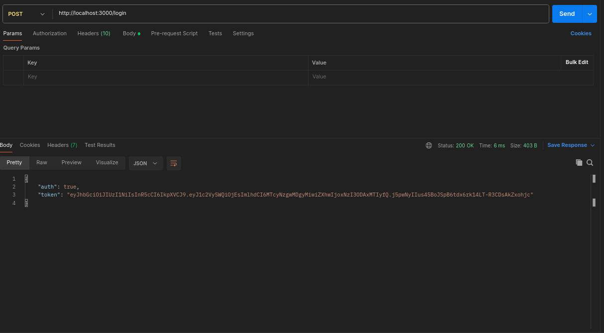
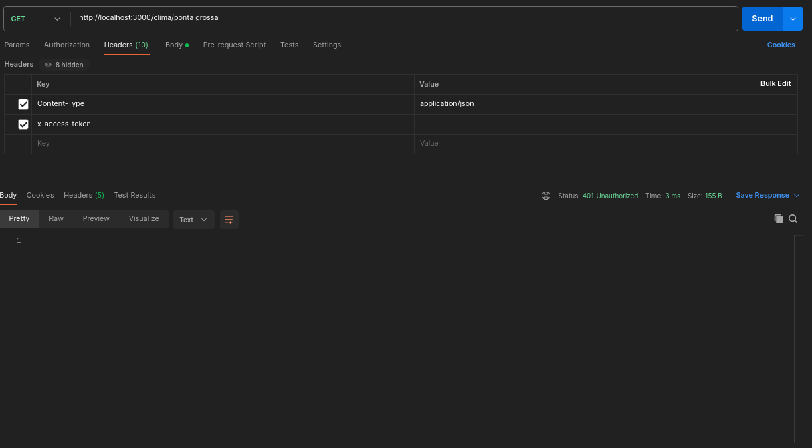
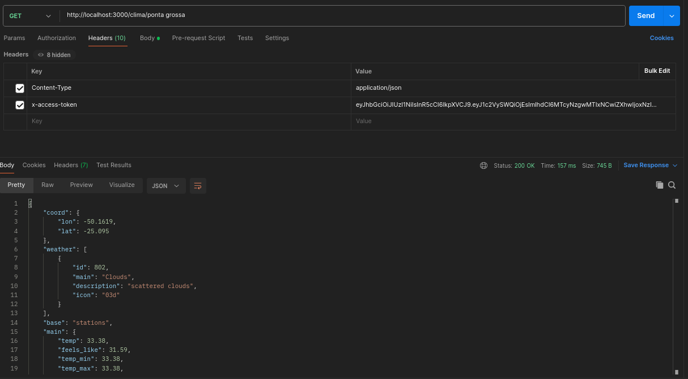

# JWT - JSON Web Tokens #

Existem vários algoritimos e padrões que transfomam informações em um token, isto é, uma chave de autenticação única, que faz sentido para o serviço ou aplicação que esteja tentando acessar no momento. Um desses padrões é o JWT, que é seguro por permitir uma autenticação entre duas partes através de um token assinado.
Um JWT é um padrão para autenticação e troca de informações definido pela RFC7519. Nele é possível armazenar de forma segura e compacta objetos JSON.


# Pacote jsonwebtoken no Node.js #
Para o funcionamento é preciso instalar o pacote jsonwebtoken e depois usá-lo para gerar e verificar tokens JWT.
Após instalar, é preciso importar o pacote no arquivo Node.js.
Para gerar um token, foi utlizado sing. Ele cria um token com base em payload e uma chave secreta que será usada para assinar o token.
 
# Rotas middleware #
O Middleware será responsável por verificar o token enviado pelo cliente, geralmente através dos cabeçalhos HTTP 

# Funcionamento

## Geração de token

```javascript
app.post('/login', (req, res) => {
    if(req.body.user === 'eu' && req.body.senha === 'senha') {
        const token = jwt.sign({userId: 1}, SECRET, { expiresIn: 300 })
        return res.json({ auth: true, token})
    }

    res.status(401).end()
})
```
### Como funciona

Ao dar post na rota /login no postman o programa verifica se dentro do body tem as informaçãoes do usuario se essas informações estiverem corretas ele cria um token usando `jwt.sign` com parametros `userId` que ele coloca esse ID no token que ira ser criado para maior segurança, o `SECRET` será a senha usada para assinatura digital que esta quardada em uma variavel no começo do código, e `expiresIn` que será uma medida de seguraça que fará o token não funcionar depois de 5 minutos, e finalmente ele ira retornar ao usuario o token criado e o id do usuario que tem esse token.

### No Postman



## Middleware de Verificação de token

```javascript
function verifyJWT(req, res, next) {
    const token = req.headers['x-access-token']
    jwt.verify(token, SECRET, (err, decoded) => {
        if(err) { 
            return res.status(401).end()
        }
        req.userId = decoded.userId
        next()
    })
}
```

### Como funciona

Nessa função `verifyJWT` com parametros `(req, res, next)` ela verifica se uma rota precisa de um token pra funcionar e manda um erro se não funcionar, primeiramente eu crio uma variavel que verifica se o token está adicionada aos headers do postman, depois é usado a função `jwt.verify` para ver se o token está certo e não foi mexido, se acontecer isso o codigo manda o postman negar o uso da rota. Ao colocar essa funcão na requição da rota desse jeito `app.get('/clima/:cidade', verifyJWT, async (req, res) => {` ele verifica as informaçoes como descrito acima.

## Rota Protegida

### Sem Token Adicionado



### Com Token Adicionado

