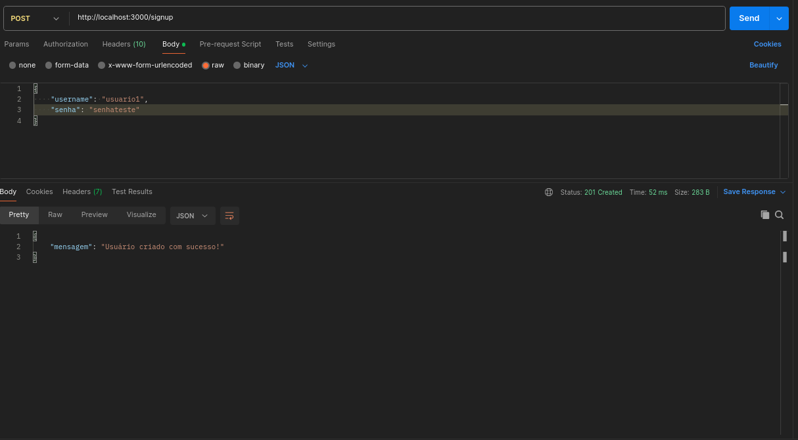

# JWT - JSON Web Tokens #

Existem vários algoritimos e padrões que transfomam informações em um token, isto é, uma chave de autenticação única, que faz sentido para o serviço ou aplicação que esteja tentando acessar no momento. Um desses padrões é o JWT, que é seguro por permitir uma autenticação entre duas partes através de um token assinado.
Um JWT é um padrão para autenticação e troca de informações definido pela RFC7519. Nele é possível armazenar de forma segura e compacta objetos JSON.


# Pacote jsonwebtoken no Node.js #
Para o funcionamento é preciso instalar o pacote jsonwebtoken e depois usá-lo para gerar e verificar tokens JWT.
Após instalar, é preciso importar o pacote no arquivo Node.js.
Para gerar um token, foi utlizado sing. Ele cria um token com base em payload e uma chave secreta que será usada para assinar o token.
 
# Rotas middleware #
O Middleware será responsável por verificar o token enviado pelo cliente, geralmente através dos cabeçalhos HTTP 

# Funcionamento

## Criação de conta

```javascript
app.post('/signup', async (req, res) => {
    const {username, senha} = req.body

    const jaexiste = await User.findOne({ username })
    if(jaexiste) {
        return res.status(400).json({ mensagem: 'Usuario ja existe!!'})
    }

    const senhahash = await bcrypt.hash(senha, 10)
    const user = new User({ username, senha: senhahash})
    try {
        await user.save();
        return res.status(201).json({ mensagem: 'Usuário criado com sucesso!' });
    } catch (error) {
        return res.status(500).json({ mensagem: 'Erro ao criar usuário', error });
    }
});
```
### Como funciona
Ele começa falando que o usuario precisa colocar o usuario e senha no corpo da requisição no postman, depois crio uma variavel `jaexiste` que procura no banco de dados se existe um usuario com o mesmo nome se existir ele mostrará uma mensagem na resposta, depois ele olha a senha que voçê colocou no corpo e usa o `bcrypt` para mudar a senha para hash no banco de dados e depois adiciona no esquema e no banco e mostra uma mensagem se deu certo ou não.

### No Postman




## Geração de token

```javascript
app.post('/login', async (req, res) => {
    const { username, senha } = req.body

    const user = await User.findOne({ username })
    if (!user) {
        return res.status(400).json({ mensagem: 'Usuario ou senha invalidos!'})
    }

    const certo = await bcrypt.compare(senha, user.senha)
    if (!certo) {
        return res.status(400).json({ message: 'Usuário ou senha inválidos.' });
    }
        const token = jwt.sign({userId: 1}, process.env.JWT_SECRET, { expiresIn: 300 })
        return res.json({ auth: true, token})
})
```
### Como funciona

Ao dar post na rota /login no postman o programa verifica se dentro do body tem as informaçãoes do usuario se essas informações estiverem corretas ele cria um token usando `jwt.sign` com parametros `userId` que ele coloca esse ID no token que ira ser criado para maior segurança, o `SECRET` será a senha usada para assinatura digital que esta quardada em uma variavel no começo do código, e `expiresIn` que será uma medida de seguraça que fará o token não funcionar depois de 5 minutos, e finalmente ele ira retornar ao usuario o token criado e o id do usuario que tem esse token.

### No Postman


## Middleware de Verificação de token

```javascript
function verifyJWT(req, res, next) {
    const token = req.headers['x-access-token']
    jwt.verify(token, SECRET, (err, decoded) => {
        if(err) { 
            return res.status(401).end()
        }
        req.userId = decoded.userId
        next()
    })
}
```

### Como funciona

Nessa função `verifyJWT` com parametros `(req, res, next)` ela verifica se uma rota precisa de um token pra funcionar e manda um erro se não funcionar, primeiramente eu crio uma variavel que verifica se o token está adicionada aos headers do postman, depois é usado a função `jwt.verify` para ver se o token está certo e não foi mexido, se acontecer isso o codigo manda o postman negar o uso da rota. Ao colocar essa funcão na requição da rota desse jeito `app.get('/clima/:cidade', verifyJWT, async (req, res) => {` ele verifica as informaçoes como descrito acima.

## Rota Protegida

### Sem Token Adicionado


### Com Token Adicionado

